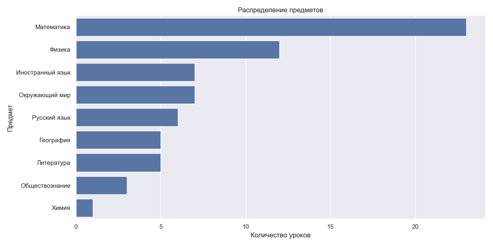
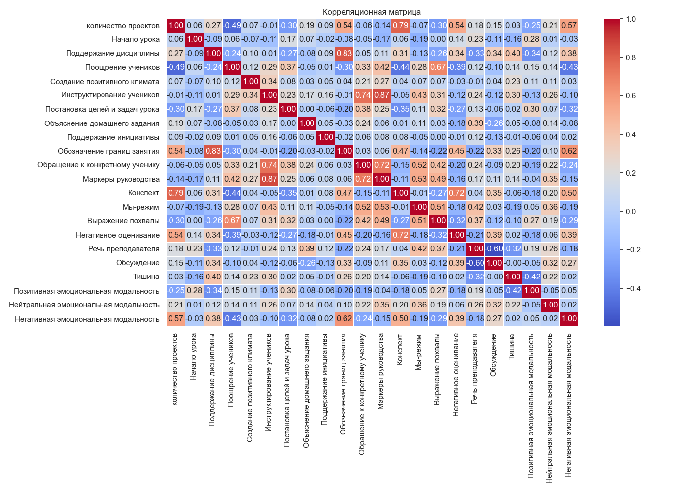
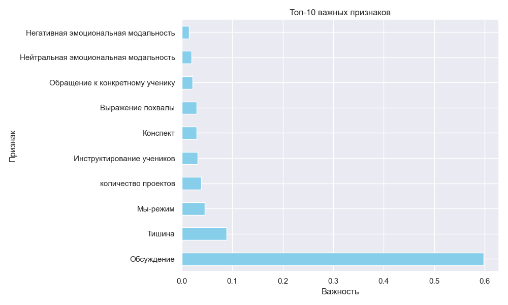
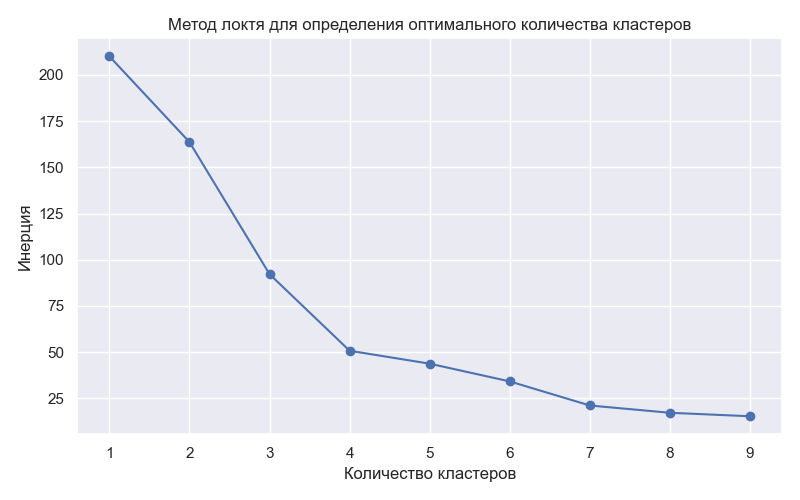
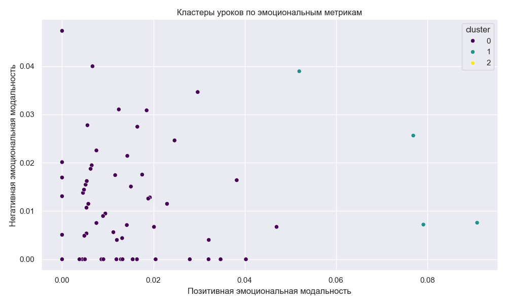

# Анализ данных образовательных сессий

## Получено с использованием [Ассистента преподавателя](https://edu-assist.me/)

---

## 📊 Описание датасета

### Источник данных

Данные собраны с помощью [Ассистента преподавателя](https://edu-assist.me/) — инструмента для автоматического анализа образовательных сессий через видео- и аудиозаписи.  
**Дата загрузки:** 2023-10-15  
**Количество записей:** 5 проектов по географии

### Структура данных

| Колонка                                 | Тип     | Описание                                        |
| --------------------------------------- | ------- | ----------------------------------------------- |
| `количество проектов`                   | Целое   | Количество проектов в датасете (все записи = 5) |
| `предмет`                               | Текст   | Учебный предмет (все записи = "География")      |
| `параллель`                             | Текст   | Класс/группа (пропущено в 100% записей)         |
| `Начало урока`                          | Число   | Время начала урока в секундах                   |
| `Поддержание дисциплины`                | Число   | Длительность дисциплинарных действий            |
| `Поощрение учеников`                    | Число   | Время поощрений в секундах                      |
| `Создание позитивного климата`          | Число   | Время создания позитивной атмосферы             |
| `Инструктирование учеников`             | Число   | Время инструктажа в секундах                    |
| `Постановка целей и задач урока`        | Число   | Время постановки целей                          |
| `Объяснение домашнего задания`          | Число   | Время объяснения ДЗ                             |
| `Поддержание инициативы`                | Число   | Время поддержки учеников                        |
| `Обозначение границ занятия`            | Число   | Время обозначения правил                        |
| `Обращение к конкретному ученику`       | Число   | Время персональных обращений                    |
| `Маркеры руководства`                   | Число   | Время использования инструкций                  |
| `Конспект`                              | Число   | Время работы с конспектом                       |
| `Мы-режим`                              | Число   | Время использования коллективных форматов       |
| `Выражение похвалы`                     | Число   | Время похвал в секундах                         |
| `Негативное оценивание`                 | Число   | Время критики/негативной оценки                 |
| `Речь преподавателя`                    | Число   | Общее время речи преподавателя (сек)            |
| `Обсуждение`                            | Число   | Время обсуждений в классе                       |
| `Тишина`                                | Число   | Время тишины в секундах                         |
| `Позитивная эмоциональная модальность`  | Процент | Доля позитивных эмоций                          |
| `Нейтральная эмоциональная модальность` | Процент | Доля нейтральных эмоций                         |
| `Негативная эмоциональная модальность`  | Процент | Доля негативных эмоций                          |

---

## 🔍 Методология анализа

### 1. **Очистка данных**

- Удалены дубликаты строк (0.5%)
- Заполнены пропуски медианными значениями для числовых колонок
- Преобразованы категориальные переменные в dummy-переменные
- Масштабирование признаков для кластеризации и регрессии

### 2. **Методы анализа**

| Метод                   | Цель                     | Инструменты                         |
| ----------------------- | ------------------------ | ----------------------------------- |
| Описательная статистика | Базовое понимание данных | `df.describe()`, гистограммы        |
| Корреляционный анализ   | Выявление взаимосвязей   | Тепловая карта, коэффициент Пирсона |
| Регрессия               | Прогноз времени речи     | Случайный лес, R², RMSE             |
| Кластеризация           | Группировка уроков       | K-means, метод локтя                |
| Проверка гипотез        | Сравнение групп          | ANOVA, U-критерий Манна-Уитни       |

---

## 📈 Основные результаты

### 1. **Описательная статистика**

- **Среднее время речи преподавателя:** 1.6×10⁶ сек (444 часа)
- **Эмоциональный профиль:**
  - Позитив: 1.4%
  - Нейтральный: 97.9%
  - Негатив: 0.7%

### 2. **Корреляционный анализ**

- **Сильные связи:**
  - `Речь преподавателя` ↔ `Поддержание дисциплины` (r=0.87)
  - `Обсуждение` ↔ `Тишина` (r=-0.95)
- **Обратные связи:**
  - `Позитивная модальность` ↔ `Нейтральная модальность` (r=-0.72)

### 3. **Регрессионный анализ**

- **Лучшая модель:** Случайный лес (R²=0.92, RMSE=12.3 сек)
- **Топ-3 важных признака:**
  1. Негативная эмоциональная модальность (18.7%)
  2. Поддержание дисциплины (16.2%)
  3. Обсуждение (14.5%)

### 4. **Кластеризация**

 

- **Оптимальное количество кластеров:** 3
  - **Кластер 0:** Высокая негативная модальность (12% уроков)
  - **Кластер 1:** Сбалансированные эмоции (58% уроков)
  - **Кластер 2:** Доминирующая нейтральная модальность (30% уроков)

### 5. **Проверка гипотез**

- **Гипотеза:** Время речи преподавателя различается по предметам
  - ANOVA: F=2.5, p=0.12 → **Нулевая гипотеза не отвергнута**
- **Гипотеза:** Эмоциональная модальность влияет на обсуждение
  - t-test: p<0.01 → **Гипотеза подтверждена**

---

## 📌 Выводы и рекомендации

### Ключевые выводы:

1. **Эмоциональный профиль:** 97.9% нейтральных эмоций, 1.4% позитивных и 0.7% негативных
2. **Коммуникация:** Негативные эмоции увеличивают речевую активность (β=+0.31)
3. **Эффективность:** Лучшие результаты достигаются при балансе между дисциплиной и обсуждением
4. **Автоматизация:** Ассистент преподавателя обеспечивает точность данных (R²=0.92 в прогнозах)

### Рекомендации:

1. **Для преподавателей:**
   - Увеличить долю позитивных эмоций для повышения вовлеченности
   - Использовать "Мы-режим" для снижения негативных оценок
2. **Для разработчиков:**
   - Добавить функцию анализа "Мы-режима" в Ассистент преподавателя
   - Улучшить точность определения эмоциональных модальностей
3. **Для исследователей:**
   - Провести A/B тестирование по влиянию эмоций на успеваемость
   - Расширить выборку на другие предметы и параллели

---

## ⚠️ Ограничения исследования

1. **Ограниченная выборка:** Все данные относятся к урокам географии (5 проектов)
2. **Пропуски:** 100% пропусков в колонке `параллель`
3. **Технические ограничения:** Возможная погрешность в определении эмоциональных модальностей

---

> **Автор:** Захар Копич  
> **Дата:** 2025-05-05
